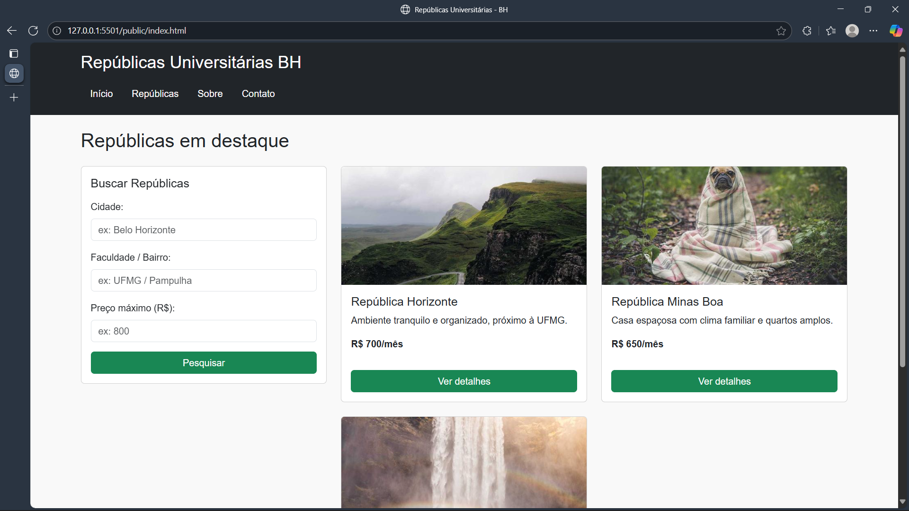
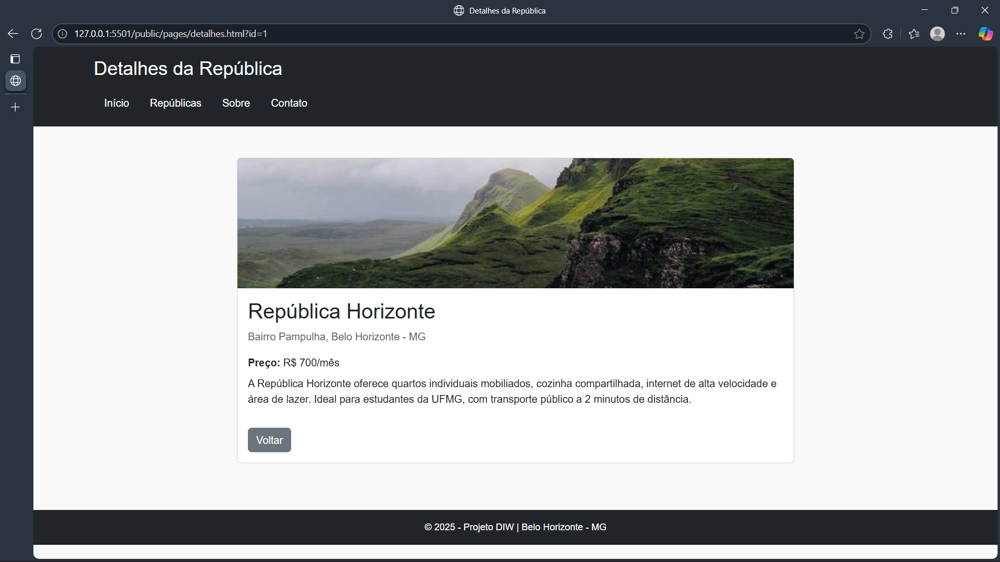

# Trabalho Prático 05 - Semanas 7 e 8

**Páginas de detalhes dinâmicas**

Nessa etapa, vamos evoluir o trabalho anterior, acrescentando a página de detalhes, conforme o  projeto escolhido. Imagine que a página principal (home-page) mostre um visão dos vários itens que existem no seu site. Ao clicar em um item, você é direcionado pra a página de detalhes. A página de detalhe vai mostrar todas as informações sobre o item do seu projeto. seja esse item uma notícia, filme, receita, lugar turístico ou evento.

Leia o enunciado completo no Canvas. 

**IMPORTANTE:** Assim como informado anteriormente, capriche na etapa pois você vai precisar dessa parte para as próximas semanas. 

**IMPORTANTE:** Você deve trabalhar e alterar apenas arquivos dentro da pasta **`public`,** mantendo os arquivos **`index.html`**, **`styles.css`** e **`app.js`** com estes nomes, conforme enunciado. Deixe todos os demais arquivos e pastas desse repositório inalterados. **PRESTE MUITA ATENÇÃO NISSO.**

## Informações Gerais

- Nome: Douglas Alexandre Marçal de Freitas
- Matricula: 898839
- Proposta de projeto escolhida: Repúblicas BH
- Breve descrição sobre seu projeto: Site para ajudar universitários a encontrar repúblicas na região de BH

## Print da Home-Page



## Print da página de detalhes do item



## Cole aqui abaixo a estrutura JSON utilizada no app.js

```javascript
const dados = [
  {
    id: 1,
    nome: "República Horizonte",
    descricao: "Ambiente tranquilo e organizado, próximo à UFMG.",
    preco: "R$ 700/mês",
    localizacao: "Bairro Pampulha, Belo Horizonte - MG",
    imagem: "https://picsum.photos/id/1018/600/400",
    detalhes:
      "A República Horizonte oferece quartos individuais mobiliados, cozinha compartilhada, internet de alta velocidade e área de lazer. Ideal para estudantes da UFMG, com transporte público a 2 minutos de distância."
  },
  {
    id: 2,
    nome: "República Minas Boa",
    descricao: "Casa espaçosa com clima familiar e quartos amplos.",
    preco: "R$ 650/mês",
    localizacao: "Bairro Santa Efigênia, Belo Horizonte - MG",
    imagem: "https://picsum.photos/id/1025/600/400",
    detalhes:
      "A República Minas Boa possui 5 quartos, 3 banheiros, área externa com churrasqueira e lavanderia. Próxima a bares, supermercados e transporte público."
  },
  {
    id: 3,
    nome: "República Central BH",
    descricao: "Localização privilegiada no coração de BH.",
    preco: "R$ 800/mês",
    localizacao: "Centro, Belo Horizonte - MG",
    imagem: "https://picsum.photos/id/1035/600/400",
    detalhes:
      "República moderna com quartos individuais, cozinha equipada e áreas de convivência. Próxima a faculdades particulares e pontos de ônibus."
  }
]
```